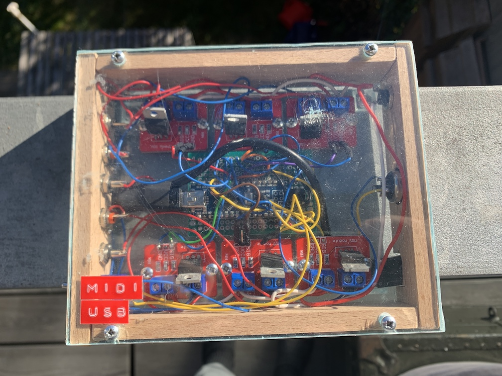
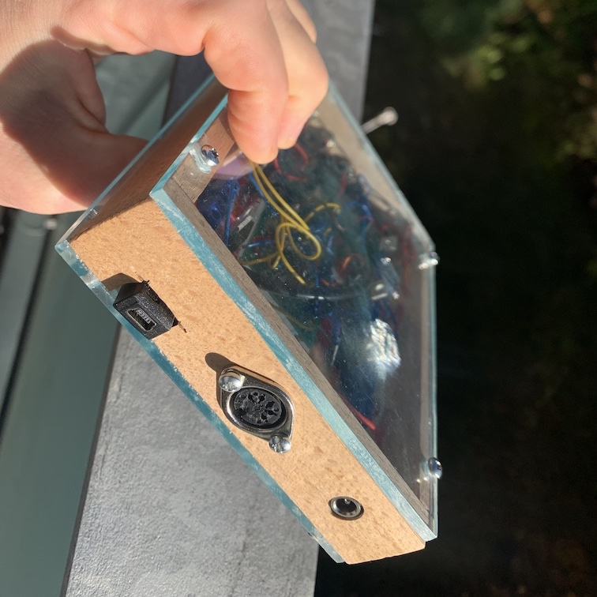
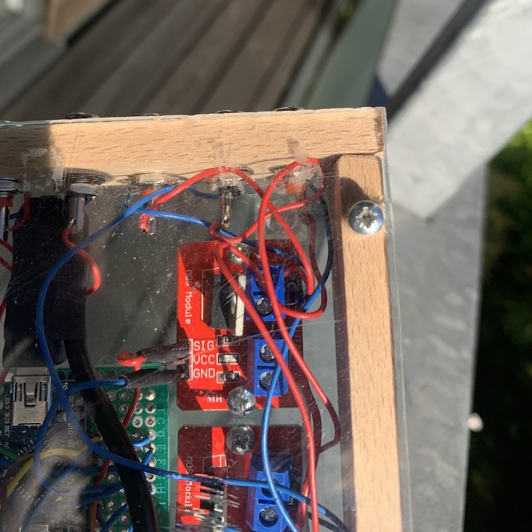

# midinoid
Arduino-based unit for controlling solenoids and other actuators for musical projects using MIDI.

The midinoid is a 6-channel unit for driving solenoids and other actuators using the Musical Instrument Digital Interface (MIDI) communication protocol. 
The principle is simple: When it receives a note via a the standard 6-pin MIDI cable, it produces an output voltage at one of the six output channels that will drive a solenoid, motor, buzzer or whatever is connected to the output. The connected actuators can then produce sounds or initiate another desired effect. See the [Demonstration section](#demonstration) for examples.

## Technical specs & construction notes
The module comprises the following components:
- PCB 
- Arduino Nano 
- 6 MOSFET modules (featuring an IRF520 MOSFET)
- 6-pin connector for MIDI input
- 6N138 optocoupler and 2 220 Ohm resistors for the MIDI in circuit
- 6 female cinch connectors for output
- 6 protection diodes
- 1 switch 
- 1 connector for the electric supply (5-20 V)
- USB extension cable
- wire

The (flyback) diodes are used protection of the MOSFETS agains electromotive force.
The voltage supply is with positive on the center pin and negative at ring. The connectd AC adapter needs to be poled accordingly.

Each of the 6 MOSFETS is controlled by one analog channel of the Arduino (via PWM). This way the MOSFETS can be route the input voltage gradually, based on the velocity value of MIDI notes (see below) and effectively producing effects of variable intensities. 
The Arduino Nano's pins that are used for controlling the MOSFETS are channels 4, 5, 6, 7, 8, and 9.

The switch is used for toggling between MIDI connection (operation mode) and USB connection  of the Arduino (for programming the Arduino).

## Functionality

The module can be operated in two ways, the "percussive" mode for firing single actions (one action per note), and the "harmony" mode for making actuators vibrate at the frequency of the input note.
Operation modes are selected by picking the according MIDI channel when sending notes.  

### Percussive mode

The percussive mode is controlled by MIDI channel 1. 
The percussive mode uses the MIDI notes 100, 101, 102, 103, 104, 105 or, in note values, E6, F6, F#6, G6, G#6, and A6. The output channels are then outputs 1 to 6.
The output channel will go high on note on events and low on note offs on the respective channels (1-6). The velocity values from the MIDI notes (0-127) will be linearly mapped to output voltage (or, more precisely, pulse widths as the operation works via PWM) with velocity 0 no output and 127 the maximum voltage, corresponding to the one supplied by the AC adapter. 
Not that the value will also stay high for as long as the note is played. However, for savety reasons, the maximum length is set to 1000 ms to avoid that an actuator, like a solenoid, accidentally stays on for long time due to, for example, a technical problem or interruption of the MIDI connection, which can cause overheating or danger of fire. If a longer "high" time is desired, the note on command has to be repeated after 1000 ms (or earlier).

### Harmony mode

The "harmony" mode is controlled by using the MIDI channels 2-7, where channel 2 communicates with output channel 1, 3 with, 2 and so forth (7 controls output 6).
This means that when picking MIDI channel 2, only output channel 1 is controlled and note values now represent frequency instead. Concretely, the harmony mode will make the output oscillatatory where it is turned on and off according to the frequency of the input note transposed two octaves down. This is because most actuators will not do much at higher frequencies of several hundreds of Hertz or even Kilohertz. So the lower range is more interesting. Note that the output actually turns PWM on and off at the note frequency. This means, also in harmoony mode the note velocity is translated into output voltages. 

## Demonstration

### Percussive mode
In this clip, several solenoids are connected to plastic watering cans. In the video, the speed of playback is increased and then lowered to showcase the speed of the solenoids. Excusee the stress ;)

[Download and watch the video](doc/vid/percussivemode.webm)

### Harmony mode demo
Short clip showcasing the harmony mode. Here, a little valve is connected.

[Download and watch the video](doc/vid/harmonymode.webm)

